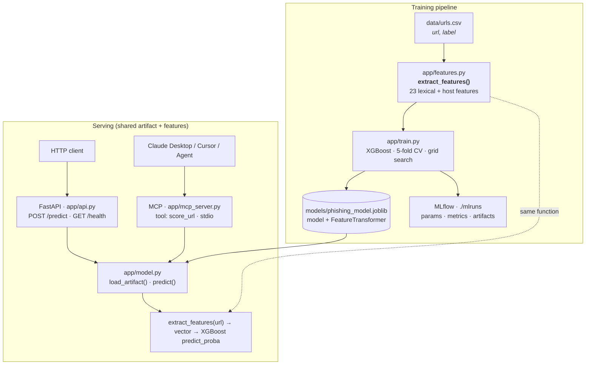

# Phishing URL Classifier

Production-style phishing URL classifier with a shared feature pipeline, gradient-boosted model, FastAPI REST API, and MCP tool for external LLM agents.

## Highlights

* Built an XGBoost-based phishing URL classifier using 23 engineered lexical and host-based features.
* Developed a FastAPI REST API for real-time URL risk scoring.
* Exposed model inference through a FastMCP server for AI-agent integration.
* Integrated with Cursor AI using a custom MCP tool (`score_url`).
* Added Dockerized deployment and MLflow experiment tracking.
* Achieved 15/15 passing automated tests across feature extraction, model inference, and API functionality.


## Architecture



> Standalone SVG (for export/slides): [docs/architecture.svg](docs/architecture.svg)

## MCP Integration

This project exposes the phishing detection model as a Model Context Protocol (MCP) tool, allowing AI agents such as Cursor and Claude Desktop to perform real-time phishing URL analysis.

### Available Tool

**score_url(url)**

Example:

Input:
https://google.com

Output:

```json
{
  "label": "benign",
  "probability": 0.008849
}
```

Input:
http://paypal-security-login.verify-account.ru

Output:

```json
{
  "label": "phishing",
  "probability": 0.993625
}
```

The MCP server uses the same trained model artifact and feature extraction pipeline as the FastAPI REST API, eliminating train/serve skew.


**Data flow**

1. **Training** — `app/train.py` loads labeled URLs, calls `extract_features()` for every row, trains XGBoost with stratified split + 5-fold CV + grid search, and saves a single joblib artifact.
2. **Serving** — Both `app/api.py` (REST) and `app/mcp_server.py` (MCP) load the same `models/phishing_model.joblib` at startup and call the identical `extract_features()` function — no train/serve skew.
3. **Tracking** — MLflow logs params, metrics, and artifacts to `./mlruns` (local file store).

## 23 Features

All features are extracted by `app/features.py::extract_features()` and documented in its docstring.

| # | Feature | Description |
|---|---------|-------------|
| 1 | `url_length` | Total character count of the URL |
| 2 | `host_length` | Character count of the hostname |
| 3 | `path_depth` | Number of non-empty path segments |
| 4 | `subdomain_count` | Dot-separated labels before the registrable domain |
| 5 | `digit_ratio` | Fraction of characters that are digits |
| 6 | `special_char_count` | Count of punctuation/special characters |
| 7 | `has_ip_as_host` | 1 if hostname is an IPv4 literal |
| 8 | `has_at_symbol` | 1 if `@` appears (credential-obfuscation signal) |
| 9 | `hyphen_count` | Total hyphen characters |
| 10 | `url_entropy` | Shannon entropy of URL characters (bits) |
| 11 | `tld_length` | Length of the top-level domain label |
| 12 | `is_https` | 1 if scheme is HTTPS |
| 13 | `suspicious_keyword_count` | Count of phishing-related keywords |
| 14 | `dot_count` | Total `.` characters |
| 15 | `slash_count` | Total `/` characters |
| 16 | `query_param_count` | Number of distinct query parameters |
| 17 | `has_port` | 1 if a non-default port is present |
| 18 | `double_slash_in_path` | `//` sequences after the scheme |
| 19 | `percent_encoding_count` | `%XX` encoded byte sequences |
| 20 | `uppercase_ratio` | Fraction of alphabetic chars that are uppercase |
| 21 | `longest_token_length` | Longest alphanumeric token length |
| 22 | `has_redirect_keyword` | 1 if redirect-style keywords appear |
| 23 | `host_digit_count` | Digit characters in the hostname |

## Quick Start

### Prerequisites

- Python 3.11+ (Docker image uses 3.11)
- pip

### Setup

```bash
git clone https://github.com/akulapranisha/Phishing-URL-Classifier-MCP-Tool.git
cd Phishing-URL-Classifier-MCP-Tool
python -m venv .venv
# Windows: .venv\Scripts\activate
# macOS/Linux: source .venv/bin/activate
pip install -r requirements.txt
cp .env.example .env
```

### Dataset

A **580-row sample dataset** ships at `data/urls.csv` (generated by `scripts/generate_sample_dataset.py`).

For the full public dataset (~235k URLs), download the [PhiUSIIL Phishing URL Dataset](https://archive.ics.uci.edu/dataset/967/phiusiil+phishing+url+dataset):

```bash
python scripts/fetch_dataset.py --output data/urls_full.csv
python -m app.train --data data/urls_full.csv
```

### Train

```bash
python scripts/generate_sample_dataset.py   # if data/urls.csv is missing
python -m app.train
```

Outputs:

- `models/phishing_model.joblib` — model + `FeatureTransformer`
- `data/metrics.json` — held-out evaluation metrics
- `data/confusion_matrix.png` — confusion matrix plot
- `mlruns/` — MLflow experiment runs

### Metrics (sample dataset run)

Held-out test set (116 samples) from `python -m app.train`:

| Metric | Value |
|--------|-------|
| Accuracy | 0.991 |
| Precision | 1.000 |
| Recall | 0.983 |
| F1 | 0.991 |
| ROC-AUC | 1.000 |
| CV ROC-AUC (mean ± std) | 1.000 ± 0.000 |

Best hyperparameters: `max_depth=3`, `learning_rate=0.05`, `n_estimators=100`, `subsample=0.8`, `colsample_bytree=0.8`.

> Note: Metrics on the bundled sample set are high because URLs are synthetically separable. Retrain on the full UCI dataset for production-realistic evaluation.

### REST API

```bash
uvicorn app.api:app --host 0.0.0.0 --port 8000
# or
python -m app.api
```

**Health check**

```bash
curl http://localhost:8000/health
```

**Predict**

```bash
curl -X POST http://localhost:8000/predict \
  -H "Content-Type: application/json" \
  -d '{"url": "http://paypa1-secure-login.com/signin"}'
```

Response:

```json
{
  "label": "phishing",
  "probability": 0.987654,
  "features_used": 23
}
```

The model is loaded once at startup and kept in memory for sub-60ms inference.

### MCP Server (`score_url`)

Run standalone over stdio:

```bash
python -m app.mcp_server
```

**Tool schema**

| Field | Value |
|-------|-------|
| Name | `score_url` |
| Input | `{ "url": "<string>" }` |
| Output | `{ "label": "phishing" \| "benign", "probability": <float> }` |

#### Claude Desktop

Add to `%APPDATA%\Claude\claude_desktop_config.json` (Windows) or `~/Library/Application Support/Claude/claude_desktop_config.json` (macOS):

```json
{
  "mcpServers": {
    "phishing-url-classifier": {
      "command": "python",
      "args": ["-m", "app.mcp_server"],
      "cwd": "C:\\Users\\aneha\\URL",
      "env": {
        "MODEL_PATH": "models/phishing_model.joblib"
      }
    }
  }
}
```

Use an absolute `cwd` path on your machine.

#### Cursor

Add to `.cursor/mcp.json` in your project (or global Cursor MCP settings):

```json
{
  "mcpServers": {
    "phishing-url-classifier": {
      "command": "python",
      "args": ["-m", "app.mcp_server"],
      "cwd": "C:\\Users\\aneha\\URL"
    }
  }
}
```

Restart Cursor / Claude Desktop after saving. The agent can then call `score_url` with a URL string.

#### External agentic RAG project

Point your agent's MCP client at the same stdio command. Both the REST API and MCP tool load `models/phishing_model.joblib` and share `extract_features()` — wire either surface into your RAG pipeline for URL risk scoring.

### Docker

```bash
# Train (optional profile)
docker compose --profile train run --rm train

# Serve API
docker compose up api
```

MCP over stdio:

```bash
docker compose --profile mcp run --rm mcp
```

### Tests

```bash
python -m pytest -q
```

Covers feature extraction, model load/predict, and the `/predict` endpoint.

### Configuration

Environment variables (see `.env.example`):

| Variable | Default | Description |
|----------|---------|-------------|
| `DATA_PATH` | `data/urls.csv` | Training CSV path |
| `MODEL_PATH` | `models/phishing_model.joblib` | Saved artifact |
| `PHISHING_THRESHOLD` | `0.5` | Classification threshold |
| `MLFLOW_TRACKING_URI` | `file:./mlruns` | MLflow backend |
| `MONITORING_ENABLED` | `false` | Emit metric events via `app/monitoring.py` |
| `LOG_JSON` | `false` | JSON structured logs |

## Project Layout

```
app/
  features.py        # SHARED feature extraction (23 features)
  train.py           # Training CLI
  model.py           # load/save artifact, predict()
  api.py             # FastAPI REST API
  mcp_server.py      # MCP server (score_url)
  config.py          # pydantic-settings
  logging_config.py  # structlog setup
  monitoring.py      # monitoring seam
data/
  urls.csv           # sample labeled dataset
  metrics.json       # evaluation output (after train)
models/
  phishing_model.joblib
mlruns/              # MLflow local tracking
tests/
docs/
  architecture.svg
scripts/
  generate_sample_dataset.py
  fetch_dataset.py
```

## License

MIT
